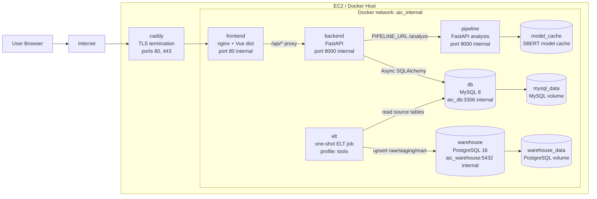
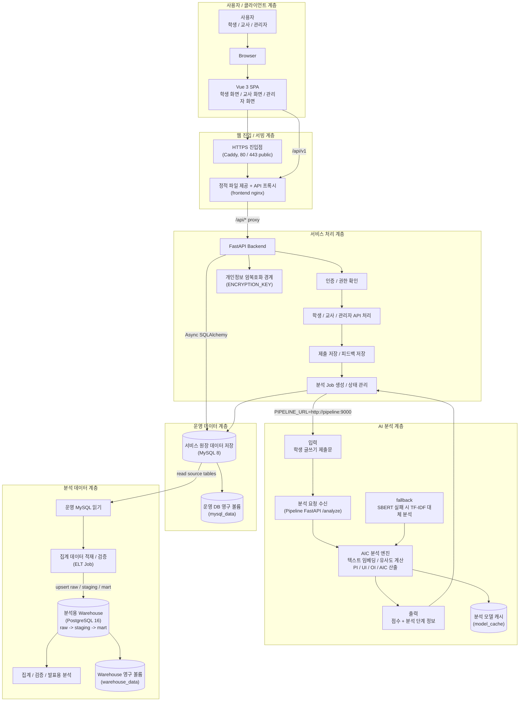
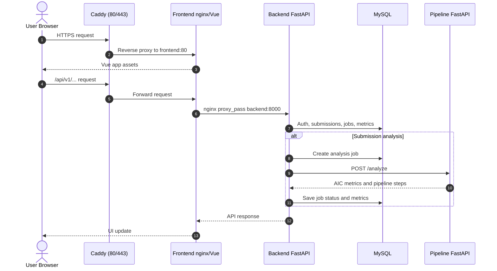

# System Architecture

이 문서는 AIC Web 프로젝트의 실행 구조와 서비스 경계를 빠르게 이해하기 위한 시스템 아키텍처 요약입니다.

## 전체 구조



## Layered Architecture

발표용 핵심 메시지는 다음과 같습니다.

> AIC Web은 사용자 화면, 웹 진입/서빙, 서비스 처리, AI 분석, 운영 데이터, 분석 데이터 처리를 명확히 분리한 오픈소스 기반 웹 아키텍처입니다. 각 계층은 독립적인 책임을 가지며, Docker Compose로 재현 가능하게 구성되어 있습니다.

이 다이어그램은 외부 평가위원이 구현 세부사항보다 "역할 분리가 잘 되어 있는가"를 빠르게 이해할 수 있도록 기능 중심 계층명과 보조 기술명을 함께 사용합니다.



| 발표용 계층명 | 보조 기술 표기 | 발표에서 강조할 책임 |
| --- | --- | --- |
| 사용자 / 클라이언트 계층 | Browser, Vue 3 SPA | 학생/교사/관리자가 브라우저에서 Vue 기반 역할별 화면을 사용합니다. |
| 웹 진입 / 서빙 계층 | Caddy, frontend nginx, HTTPS | 외부 HTTPS 요청을 받고, Vue 정적 파일 제공과 `/api` 요청 프록시를 담당합니다. |
| 서비스 처리 계층 | FastAPI Backend | 인증/권한 확인, 역할별 API 처리, 제출/피드백 저장, 분석 job 생성과 상태 관리를 담당합니다. |
| AI 분석 계층 | FastAPI Pipeline, SBERT/TF-IDF, AIC engine | 학생 제출문을 입력받아 텍스트 임베딩, 유사도 계산, PI/UI/OI/AIC 지표 산출을 수행하고 결과를 backend로 반환합니다. |
| 운영 데이터 계층 | MySQL 8 | 사용자, 수업, 과제, 제출, 점수, analysis job의 운영 원장을 저장합니다. |
| 분석 데이터 계층 | ELT, PostgreSQL Warehouse | 운영 MySQL 데이터를 읽어 raw/staging/mart 구조로 적재하고, 집계/검증용 분석 데이터를 구성합니다. |

### 발표용 설명 포인트

- 역할 분리: Vue는 사용자 화면, Caddy/nginx는 웹 진입과 서빙, backend는 인증/권한/저장, pipeline은 AI 분석, database는 영속 저장을 담당합니다.
- 오픈소스 재현성: Vue, FastAPI, MySQL, PostgreSQL, Caddy, Docker Compose 기반으로 로컬과 서버에서 같은 구조를 재현할 수 있습니다.
- 유지보수성: 분석 엔진과 서비스 API가 분리되어 있어 AIC 계산 로직을 개선해도 사용자 화면과 운영 DB 경계를 크게 흔들지 않습니다.
- 분석 명확성: AI 분석 계층은 학생 제출문을 입력으로 받아 임베딩, 유사도 계산, 지표 산출을 거쳐 PI/UI/OI/AIC 점수와 분석 단계 정보를 반환합니다.
- 서비스 중심성: backend는 인증/권한 확인 후 역할별 API를 처리하고, 제출/피드백 저장과 분석 job 상태 관리를 조율합니다.
- 데이터 안정성: 운영 MySQL과 분석용 PostgreSQL warehouse를 분리해 서비스 원장 데이터와 집계/검증 데이터를 목적별로 관리합니다.

### draw.io 박스 문구 초안

```text
[사용자 / 클라이언트 계층]
사용자: 학생 / 교사 / 관리자
-> Browser
-> Vue 3 SPA 역할별 화면

[웹 진입 / 서빙 계층]
HTTPS 진입점 + 정적 파일 제공 + API 프록시
(Caddy, frontend nginx)

[서비스 처리 계층]
FastAPI Backend
-> 인증 / 권한 확인
-> 역할별 API 처리
-> 제출 / 피드백 저장
-> 분석 Job 생성 / 상태 관리

[AI 분석 계층]
학생 제출문 입력
-> /analyze 요청 수신
-> 임베딩 · 유사도 · 지표 계산
-> PI / UI / OI / AIC 결과 반환
(SBERT / TF-IDF fallback)

[운영 데이터 계층]
서비스 원장 데이터 저장
(MySQL)

[분석 데이터 계층]
운영 MySQL 읽기
-> ELT Job
-> PostgreSQL Warehouse
-> raw / staging / mart
-> 집계 / 검증
```

발표 멘트 예시는 다음과 같습니다.

> 이 시스템은 오픈소스 기술을 조합해 각 역할을 명확히 분리했습니다. 학생, 교사, 관리자는 브라우저에서 Vue 기반 역할별 화면을 사용하고, 배포 환경에서는 Caddy가 외부 HTTPS 진입점을 담당하며 frontend nginx가 정적 파일 제공과 `/api` 프록시를 수행합니다. 백엔드는 인증/권한 확인 후 역할별 API를 처리하고, 제출과 피드백 저장, 분석 job 생성과 상태 관리를 조율합니다. 실제 AI 분석 계산은 별도 파이프라인 서비스가 수행하며, 학생 제출문을 입력받아 텍스트 임베딩, 유사도 계산, PI/UI/OI/AIC 지표 산출을 수행하고 결과를 백엔드로 반환합니다. 운영 데이터는 MySQL에 저장하고, 분석과 집계가 필요한 데이터는 ELT를 통해 PostgreSQL warehouse의 raw/staging/mart 구조로 분리합니다. 따라서 화면, 웹 진입/서빙, 서비스, 분석, 데이터 계층이 독립적으로 관리되어 유지보수와 확장이 쉬운 구조입니다.

## 요청 흐름



## 서비스 역할

| 서비스 | 역할 | 외부 공개 여부 |
| --- | --- | --- |
| `caddy` | HTTPS 종료, `frontend:80`으로 reverse proxy | 공개: `80`, `443` |
| `frontend` | Vue 정적 파일 제공, `/api/`를 backend로 proxy | 운영에서는 Docker 내부만 |
| `backend` | 인증, 학생/교사/관리자 API, DB 저장, pipeline job orchestration | Docker 내부만 |
| `pipeline` | SBERT/TF-IDF 기반 AIC metric 계산 | Docker 내부만 |
| `db` | 운영 MySQL 데이터 저장 | Docker 내부만 |
| `warehouse` | 분석용 PostgreSQL warehouse | Docker 내부만 |
| `elt` | MySQL 데이터를 warehouse raw/staging/mart로 적재 | 필요 시 일회성 실행 |

## 포트와 경계

운영 실행은 다음 명령을 기준으로 합니다.

```bash
docker compose -f docker-compose.yml -f docker-compose.prod.yml up --build -d
```

운영 공개 포트는 Caddy의 `80`, `443`뿐입니다. `backend:8000`, `pipeline:9000`, `db:3306`, `warehouse:5432`는 Docker 내부 네트워크에서만 접근하도록 유지합니다.

로컬 기본 실행에서는 `docker-compose.override.yml`이 자동 병합되어 개발 편의를 위한 포트가 추가될 수 있습니다. 운영 배포 시에는 반드시 `docker-compose.yml`과 `docker-compose.prod.yml` 조합을 명시합니다.

## 데이터 경로

- 로그인과 권한 검사는 backend가 담당합니다.
- frontend는 backend의 `/api/v1`만 호출하고 pipeline을 직접 호출하지 않습니다.
- backend는 `PIPELINE_URL=http://pipeline:9000`을 통해 pipeline에 분석을 요청합니다.
- pipeline은 계산 결과만 반환하고, 영속 저장은 backend가 MySQL에 수행합니다.
- ELT는 필요할 때 MySQL의 source 테이블을 읽어 PostgreSQL warehouse의 raw, staging, mart 테이블을 갱신합니다.
