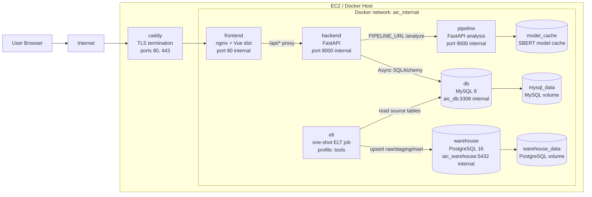
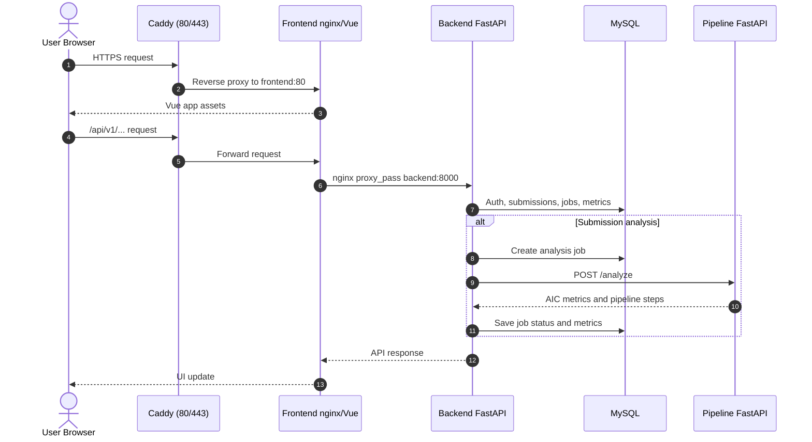

# System Architecture

이 문서는 AIC Web 프로젝트의 실행 구조와 서비스 경계를 빠르게 이해하기 위한 시스템 아키텍처 요약입니다.

## 전체 구조



## 요청 흐름



## 서비스 역할

| 서비스 | 역할 | 외부 공개 여부 |
| --- | --- | --- |
| `caddy` | HTTPS 종료, `frontend:80`으로 reverse proxy | 공개: `80`, `443` |
| `frontend` | Vue 정적 파일 제공, `/api/`를 backend로 proxy | 운영에서는 Docker 내부만 |
| `backend` | 인증, 학생/교사/관리자 API, DB 저장, pipeline job orchestration | Docker 내부만 |
| `pipeline` | SBERT/TF-IDF 기반 AIC metric 계산 | Docker 내부만 |
| `db` | 운영 MySQL 데이터 저장 | Docker 내부만 |
| `warehouse` | 분석용 PostgreSQL warehouse | Docker 내부만 |
| `elt` | MySQL 데이터를 warehouse raw/staging/mart로 적재 | 필요 시 일회성 실행 |

## 포트와 경계

운영 실행은 다음 명령을 기준으로 합니다.

```bash
docker compose -f docker-compose.yml -f docker-compose.prod.yml up --build -d
```

운영 공개 포트는 Caddy의 `80`, `443`뿐입니다. `backend:8000`, `pipeline:9000`, `db:3306`, `warehouse:5432`는 Docker 내부 네트워크에서만 접근하도록 유지합니다.

로컬 기본 실행에서는 `docker-compose.override.yml`이 자동 병합되어 개발 편의를 위한 포트가 추가될 수 있습니다. 운영 배포 시에는 반드시 `docker-compose.yml`과 `docker-compose.prod.yml` 조합을 명시합니다.

## 데이터 경로

- 로그인과 권한 검사는 backend가 담당합니다.
- frontend는 backend의 `/api/v1`만 호출하고 pipeline을 직접 호출하지 않습니다.
- backend는 `PIPELINE_URL=http://pipeline:9000`을 통해 pipeline에 분석을 요청합니다.
- pipeline은 계산 결과만 반환하고, 영속 저장은 backend가 MySQL에 수행합니다.
- ELT는 필요할 때 MySQL의 source 테이블을 읽어 PostgreSQL warehouse의 raw, staging, mart 테이블을 갱신합니다.
