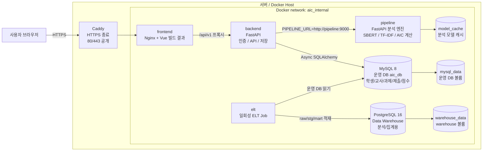
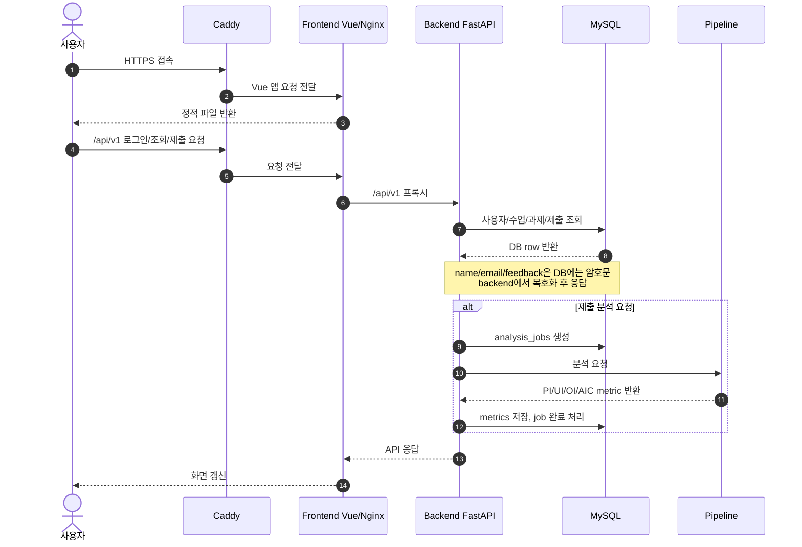
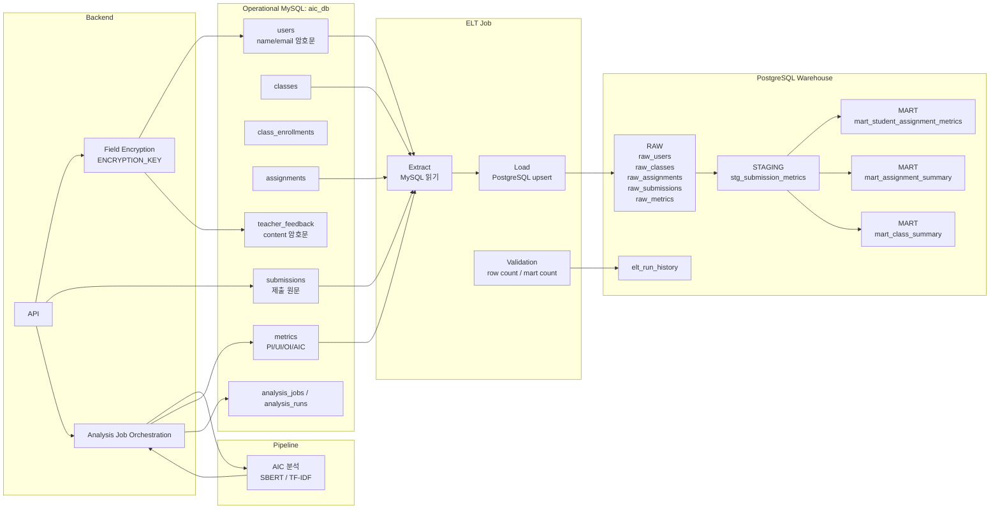

# Deployment Architecture

이 문서는 변경사항을 서버에 빌드해서 배포한다는 전제로 AIC Web의 시스템 아키텍처와 데이터 파이프라인 아키텍처를 설명합니다.

운영 배포 기준 명령은 다음 조합을 전제로 합니다.

```bash
docker compose -f docker-compose.yml -f docker-compose.prod.yml up --build -d
```

## System Architecture



외부에 공개되는 입구는 Caddy 하나입니다. 사용자는 HTTPS로 접속하고, Caddy가 Vue 프론트엔드로 요청을 넘깁니다. 프론트엔드는 정적 화면을 제공하고, API 요청은 `/api/v1` 경로로 backend에 프록시합니다.

backend는 시스템의 중심입니다. 로그인, 권한, 학생/교사/관리자 API, 제출 저장, 피드백 저장, 분석 job 생성, metric 저장을 담당합니다. pipeline은 분석 계산만 수행하고 DB에 직접 저장하지 않습니다.

이번 암호화 작업 이후 backend는 `ENCRYPTION_KEY`를 사용해 다음 필드를 저장 시 암호화하고, API 응답 시 복호화합니다.

```text
users.name
users.email
teacher_feedback.content
```

프론트엔드는 기존처럼 평문 데이터를 받지만, MySQL에는 `enc:v1:...` 형태의 암호문이 저장됩니다.

## Request Flow



## Data Pipeline Architecture



warehouse는 운영 서비스의 실시간 기능을 담당하지 않습니다. 분석과 집계를 위한 별도 저장소입니다. `elt`를 실행하면 MySQL의 핵심 테이블을 읽어서 PostgreSQL warehouse에 적재합니다.

중요한 점은 warehouse가 개인정보를 복호화하지 않는다는 것입니다. `raw_users.name`, `raw_users.email`, `stg_submission_metrics.student_name`, `mart_student_assignment_metrics.student_name`에는 암호문이 그대로 흘러갑니다. warehouse는 학생 이름을 사람이 읽기 위한 곳이 아니라, class/assignment/student id와 점수 기반으로 집계하는 저장소입니다.

## Service Responsibilities

| 서비스 | 역할 | 외부 공개 여부 |
| --- | --- | --- |
| `caddy` | HTTPS 종료, frontend로 reverse proxy | 공개: `80`, `443` |
| `frontend` | Vue 정적 파일 제공, `/api/`를 backend로 proxy | Docker 내부 |
| `backend` | 인증, API, 암복호화 경계, MySQL 저장, pipeline orchestration | Docker 내부 |
| `pipeline` | SBERT/TF-IDF 기반 AIC metric 계산 | Docker 내부 |
| `db` | 운영 MySQL 데이터 저장 | Docker 내부 |
| `warehouse` | 분석용 PostgreSQL warehouse | Docker 내부 |
| `elt` | MySQL 데이터를 warehouse raw/staging/mart로 적재 | 필요 시 일회성 실행 |

## Deployment Environment

배포 시 필요한 주요 환경변수는 다음과 같습니다.

```text
MYSQL_PASSWORD
MYSQL_ROOT_PASSWORD
WAREHOUSE_PASSWORD
JWT_SECRET
ENCRYPTION_KEY
ACME_EMAIL
```

운영에서는 DB 포트를 외부에 열지 않고 Docker 내부 네트워크에 둡니다. 외부 공개는 Caddy의 `80/443`만 두는 구성이 기본입니다.

## Existing Data Migration

기존 운영 DB에 평문 PII가 있다면 backend 이미지 배포 후 한 번 실행합니다.

```bash
docker compose run --rm backend python scripts/encrypt_existing_pii.py --dry-run
docker compose run --rm backend python scripts/encrypt_existing_pii.py
```

기존 warehouse 볼륨이 있고 암호문 길이에 맞춰 컬럼 타입을 준비해야 한다면 ELT 전에 한 번 실행합니다.

```bash
docker compose run --rm elt python scripts/prepare_warehouse_for_encrypted_pii.py
docker compose run --rm elt
```

## Summary

AIC Web은 frontend, backend, pipeline, 운영 DB, warehouse가 Docker 내부 네트워크에서 역할을 나누는 구조입니다. frontend는 사용자 경험을 담당하고, backend는 권한/저장/복호화 경계를 담당하며, pipeline은 계산만 수행합니다. MySQL은 운영 원장이고, warehouse는 암호문을 포함한 분석용 복제/집계 저장소입니다.
