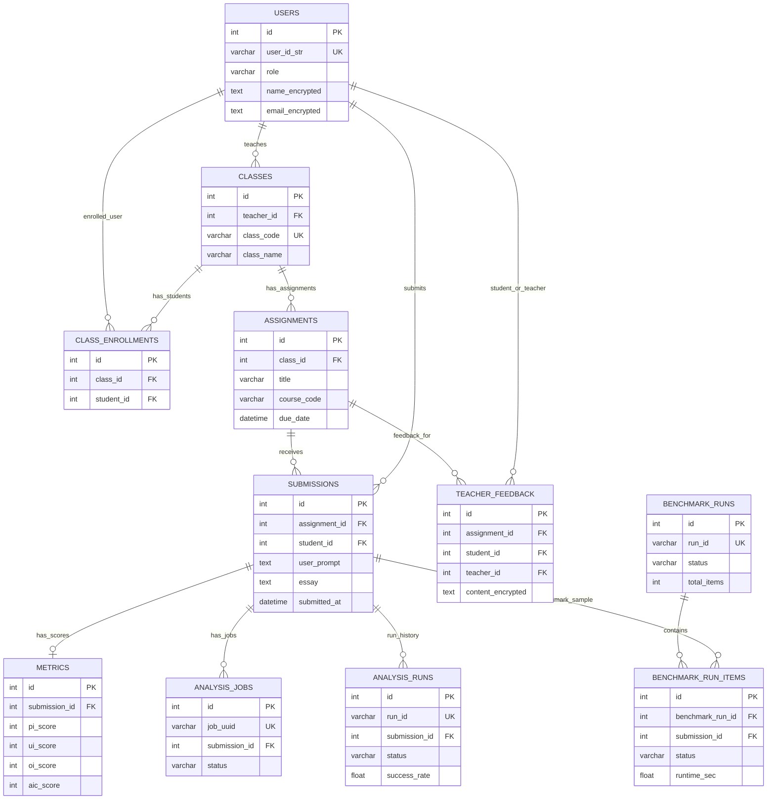
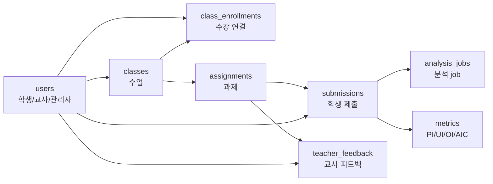

# Operational DB Presentation ERD

이 문서는 PPT 발표용으로 축약한 AIC Web 운영 DB(`aic_db`) ERD입니다.

전체 컬럼을 모두 표시하지 않고, 서비스 구현 여부와 데이터 흐름을 설명하는 데 필요한 핵심 컬럼만 남겼습니다.

- `PK`: 테이블의 기준 row를 식별하는 컬럼
- `FK`: 다른 테이블과 연결되는 핵심 컬럼
- 대표 metric: `pi_score`, `ui_score`, `oi_score`, `aic_score`
- 개인정보 컬럼은 backend에서 암호화되어 DB에 저장되므로 `name_encrypted`, `email_encrypted`, `content_encrypted`처럼 표시

## Presentation ERD



## Slide Message

```text
운영 DB는 사용자, 수업, 과제, 제출, 분석 job, AIC metric, 교사 피드백을 저장한다.
Backend는 제출 분석을 pipeline에 요청하고, 결과를 metrics와 job 상태로 운영 DB에 기록한다.
```

## Core Service Flow



## Table Grain Summary

| Group | Table | Grain | 발표용 핵심 |
| --- | --- | --- | --- |
| User/Class | `users` | 사용자 1명 | 학생/교사/관리자, 이름/이메일 암호화 |
| User/Class | `classes` | 수업 1개 | 교사가 담당하는 수업 |
| User/Class | `class_enrollments` | 학생 x 수업 | 수강 관계 |
| Assignment | `assignments` | 과제 1개 | 수업별 과제 |
| Submission | `submissions` | 제출 1건 | 학생이 과제에 제출한 글과 프롬프트 |
| Analysis | `analysis_jobs` | 분석 job 1건 | 제출 분석 요청과 상태 |
| Analysis | `metrics` | 제출별 점수 1건 | PI/UI/OI/AIC 결과 저장 |
| Feedback | `teacher_feedback` | 과제 x 학생 | 교사 피드백, 내용 암호화 |
| Admin/Quality | `analysis_runs` | 분석 실행 1건 | 관리자 분석 품질/실행 이력 |
| Benchmark | `benchmark_runs` | 벤치마크 실행 1건 | 성능/품질 검증 실행 |
| Benchmark | `benchmark_run_items` | 벤치마크 item 1건 | 제출 샘플별 벤치마크 결과 |

## Presentation Notes

PPT에서는 `Presentation ERD`를 메인으로 사용하고, 아래 문장을 발표자가 말하면 좋습니다.

```text
운영 DB는 실제 서비스 동작에 필요한 원장 데이터입니다.
사용자는 수업과 연결되고, 수업에는 과제가 있으며, 학생 제출은 분석 job과 metric으로 이어집니다.
교사 피드백과 사용자 개인정보는 암호화된 상태로 저장됩니다.
```

분석 파이프라인 연동을 강조하려면 다음 문장을 덧붙입니다.

```text
backend가 submissions를 기준으로 analysis_jobs를 만들고,
pipeline 분석 결과를 metrics 테이블에 저장해 교사/학생 화면에서 조회합니다.
```

개인정보 처리 설명이 필요하면 다음 문장을 사용합니다.

```text
users.name, users.email, teacher_feedback.content는 backend의 필드 암호화를 거쳐
DB에는 enc:v1:... 형태의 암호문으로 저장됩니다.
```

