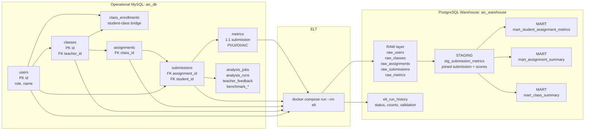

# Presentation DB & Warehouse ERD

발표에서 한눈에 설명하기 위한 요약형 ERD입니다. 세부 컬럼 전체보다 데이터 흐름과 핵심 관계를 우선합니다.

## 발표용 핵심 메시지

- 운영 DB는 수업, 학생, 과제, 제출, AIC metric을 저장합니다.
- backend는 제출 분석 job을 만들고 pipeline 결과를 `metrics`에 저장합니다.
- ELT는 운영 DB의 핵심 5개 테이블을 warehouse raw layer로 복제합니다.
- warehouse는 raw 데이터를 `stg_submission_metrics`로 결합한 뒤 학생/과제, 과제, 수업 단위 mart를 만듭니다.
- `elt_run_history`는 적재 성공/실패와 검증 상태를 기록합니다.

## Mermaid Overview

이미지 파일: `docs/presentation-db-warehouse-erd.svg`
