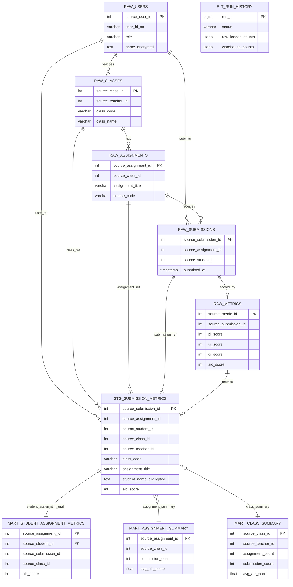

# Warehouse Presentation ERD

이 문서는 PPT 발표용으로 축약한 AIC Web 데이터웨어하우스 ERD입니다.

전체 컬럼을 모두 표시하지 않고, 발표에서 구조를 이해하는 데 필요한 핵심 컬럼만 남겼습니다.

- `PK`: 테이블의 기준 row를 식별하는 컬럼
- `source_*`: 운영 DB의 원본 id를 보존한 논리 key
- 대표 metric: `aic_score`, `avg_aic_score`, `submission_count`
- 개인정보 컬럼은 복호화하지 않고 암호문으로 적재되므로 `name_encrypted`처럼 표시

## Presentation ERD



## Slide Message

```text
운영 DB의 핵심 데이터를 RAW layer로 적재하고,
STAGING에서 제출/학생/과제/수업/점수를 결합한 뒤,
MART layer에서 학생별, 과제별, 수업별 분석 테이블을 생성한다.
```

## Table Grain Summary

| Layer | Table | Grain | 발표용 핵심 |
| --- | --- | --- | --- |
| RAW | `raw_users` | 사용자 1명 | 학생/교사 식별, 이름은 암호문 |
| RAW | `raw_classes` | 수업 1개 | 수업과 담당 교사 연결 |
| RAW | `raw_assignments` | 과제 1개 | 수업별 과제 |
| RAW | `raw_submissions` | 제출 1건 | 학생 x 과제 제출 |
| RAW | `raw_metrics` | 제출별 점수 1건 | PI/UI/OI/AIC 점수 |
| STAGING | `stg_submission_metrics` | 제출 1건 | 제출 + 학생 + 수업 + 과제 + 점수 결합 |
| MART | `mart_student_assignment_metrics` | 학생 x 과제 | 학생별 과제 성과 조회 |
| MART | `mart_assignment_summary` | 과제 1개 | 과제별 제출 수와 평균 점수 |
| MART | `mart_class_summary` | 수업 1개 | 수업별 제출 수와 평균 점수 |
| META | `elt_run_history` | ELT 실행 1회 | 적재 성공/실패와 검증 결과 |

## Presentation Notes

PPT에 넣을 때는 `Presentation ERD`만 크게 배치하고, 아래 문장을 발표자가 말하면 좋습니다.

```text
전체 컬럼을 모두 보여주기보다, 데이터가 어떤 key로 연결되고
어떤 단위의 mart로 집계되는지에 초점을 맞췄습니다.
RAW는 원천 복제, STAGING은 조인, MART는 분석용 집계 테이블입니다.
```

개인정보 처리 설명이 필요하면 다음 문장을 덧붙입니다.

```text
사용자 이름과 이메일은 backend에서 암호화된 상태로 운영 DB에 저장되고,
warehouse에도 복호화하지 않은 암호문 상태로 적재됩니다.
```
