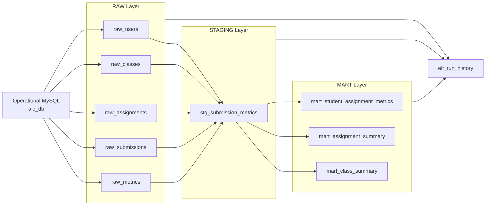

# Warehouse ERD

이 문서는 AIC Web의 PostgreSQL 데이터웨어하우스(`aic_warehouse`) ERD를 설명합니다.

warehouse는 운영 MySQL DB의 핵심 테이블을 ELT로 복제한 뒤, 분석에 쓰기 좋은 형태로 `raw -> staging -> mart` 계층을 만듭니다. 물리적인 foreign key 제약을 강하게 두기보다, 운영 DB의 id를 `source_*` 컬럼으로 보존해 논리 관계를 구성합니다.

## Layer Overview



## Mermaid ERD

```mermaid
erDiagram
    RAW_USERS {
        int source_user_id PK
        varchar user_id_str
        varchar role
        text name
        text email
        timestamp created_at
        timestamp updated_at
        timestamp loaded_at
    }

    RAW_CLASSES {
        int source_class_id PK
        varchar class_code
        varchar class_name
        int source_teacher_id
        varchar semester
        timestamp created_at
        timestamp loaded_at
    }

    RAW_ASSIGNMENTS {
        int source_assignment_id PK
        int source_class_id
        varchar title
        text description
        varchar course_code
        timestamp due_date
        timestamp created_at
        timestamp loaded_at
    }

    RAW_SUBMISSIONS {
        int source_submission_id PK
        int source_assignment_id UK
        int source_student_id UK
        text chatgpt_before
        text user_prompt
        text essay
        timestamp submitted_at
        timestamp loaded_at
    }

    RAW_METRICS {
        int source_metric_id PK
        int source_submission_id UK
        smallint pi_score
        smallint ui_score
        smallint oi_score
        smallint aic_score
        smallint topic_score
        float weight_pi
        float weight_ui
        float weight_oi
        int pi_depth_tokens
        float pi_depth_norm
        float pi_critical_ratio
        float pi_avg_sent_len
        float pi_ttr
        float pi_complexity
        float ui_cos_similarity
        float ui_distance
        float ui_newinfo_ratio
        float oi_topic_score_raw
        varchar embedding_backend
        timestamp computed_at
        timestamp loaded_at
    }

    STG_SUBMISSION_METRICS {
        int source_submission_id PK
        int source_assignment_id UK
        int source_student_id UK
        int source_class_id
        int source_teacher_id
        varchar class_code
        varchar class_name
        varchar assignment_title
        varchar course_code
        varchar student_user_id_str
        text student_name
        varchar teacher_user_id_str
        timestamp submitted_at
        timestamp computed_at
        smallint pi_score
        smallint ui_score
        smallint oi_score
        smallint aic_score
        smallint topic_score
        varchar embedding_backend
        timestamp transformed_at
    }

    MART_STUDENT_ASSIGNMENT_METRICS {
        int source_assignment_id PK
        int source_student_id PK
        int source_submission_id
        int source_class_id
        varchar class_code
        varchar class_name
        varchar assignment_title
        varchar course_code
        varchar student_user_id_str
        text student_name
        timestamp submitted_at
        timestamp computed_at
        smallint pi_score
        smallint ui_score
        smallint oi_score
        smallint aic_score
        smallint topic_score
        timestamp refreshed_at
    }

    MART_ASSIGNMENT_SUMMARY {
        int source_assignment_id PK
        int source_class_id
        varchar class_code
        varchar class_name
        varchar assignment_title
        varchar course_code
        int submission_count
        float avg_pi_score
        float avg_ui_score
        float avg_oi_score
        float avg_aic_score
        float avg_topic_score
        timestamp min_submitted_at
        timestamp max_submitted_at
        timestamp refreshed_at
    }

    MART_CLASS_SUMMARY {
        int source_class_id PK
        varchar class_code
        varchar class_name
        int source_teacher_id
        varchar teacher_user_id_str
        int assignment_count
        int submission_count
        float avg_pi_score
        float avg_ui_score
        float avg_oi_score
        float avg_aic_score
        float avg_topic_score
        timestamp refreshed_at
    }

    ELT_RUN_HISTORY {
        bigint run_id PK
        timestamptz started_at
        timestamptz finished_at
        int duration_ms
        varchar status
        jsonb raw_loaded_counts
        jsonb source_counts
        jsonb warehouse_counts
        jsonb validation_failures
        text error_message
        timestamptz created_at
    }

    RAW_USERS ||--o{ RAW_CLASSES : "source_teacher_id"
    RAW_CLASSES ||--o{ RAW_ASSIGNMENTS : "source_class_id"
    RAW_ASSIGNMENTS ||--o{ RAW_SUBMISSIONS : "source_assignment_id"
    RAW_USERS ||--o{ RAW_SUBMISSIONS : "source_student_id"
    RAW_SUBMISSIONS ||--o| RAW_METRICS : "source_submission_id"

    RAW_SUBMISSIONS ||--|| STG_SUBMISSION_METRICS : "source_submission_id"
    RAW_ASSIGNMENTS ||--o{ STG_SUBMISSION_METRICS : "source_assignment_id"
    RAW_CLASSES ||--o{ STG_SUBMISSION_METRICS : "source_class_id"
    RAW_USERS ||--o{ STG_SUBMISSION_METRICS : "student/teacher"
    RAW_METRICS ||--o| STG_SUBMISSION_METRICS : "source_submission_id"

    STG_SUBMISSION_METRICS ||--|| MART_STUDENT_ASSIGNMENT_METRICS : "assignment + student"
    STG_SUBMISSION_METRICS }o--|| MART_ASSIGNMENT_SUMMARY : "group by assignment"
    STG_SUBMISSION_METRICS }o--|| MART_CLASS_SUMMARY : "group by class"
```



## Table Groups

### RAW Layer

RAW layer는 운영 DB의 핵심 테이블을 거의 그대로 복제합니다.

| Table | Purpose | Primary Key |
| --- | --- | --- |
| `raw_users` | 사용자 원천 데이터 복제 | `source_user_id` |
| `raw_classes` | 수업 원천 데이터 복제 | `source_class_id` |
| `raw_assignments` | 과제 원천 데이터 복제 | `source_assignment_id` |
| `raw_submissions` | 제출 원천 데이터 복제 | `source_submission_id` |
| `raw_metrics` | 제출별 AIC metric 원천 데이터 복제 | `source_metric_id` |

`raw_users.name`, `raw_users.email`은 backend에서 암호화된 값이 그대로 적재될 수 있습니다. warehouse는 개인정보를 복호화하지 않습니다.

### STAGING Layer

`stg_submission_metrics`는 warehouse의 중심 조인 테이블입니다.

이 테이블은 다음 데이터를 한 행으로 결합합니다.

- 제출 정보: `source_submission_id`, `submitted_at`
- 학생 정보: `source_student_id`, `student_user_id_str`, `student_name`
- 수업 정보: `source_class_id`, `class_code`, `class_name`
- 교사 정보: `source_teacher_id`, `teacher_user_id_str`
- 과제 정보: `source_assignment_id`, `assignment_title`, `course_code`
- 분석 점수: `pi_score`, `ui_score`, `oi_score`, `aic_score`, `topic_score`

`student_name`은 운영 DB에서 암호화된 상태라면 warehouse에서도 암호문 상태로 유지됩니다.

### MART Layer

MART layer는 발표, 분석, 검증에 바로 쓰기 쉬운 집계 테이블입니다.

| Table | Grain | Purpose |
| --- | --- | --- |
| `mart_student_assignment_metrics` | 학생 x 과제 | 학생별 과제 제출 점수 조회 |
| `mart_assignment_summary` | 과제 | 과제별 제출 수와 평균 점수 집계 |
| `mart_class_summary` | 수업 | 수업별 과제 수, 제출 수, 평균 점수 집계 |

### ELT Run History

`elt_run_history`는 데이터 자체의 관계 테이블이라기보다 ELT 실행 이력을 저장하는 운영 메타 테이블입니다.

저장 내용:

- 실행 시작/종료 시각
- 성공/실패 상태
- raw 적재 건수
- source/warehouse row count
- 검증 실패 목록
- 오류 메시지

## Logical Relationship Summary

warehouse의 핵심 논리 관계는 다음과 같습니다.

```text
raw_users.source_user_id
  -> raw_classes.source_teacher_id
  -> raw_submissions.source_student_id

raw_classes.source_class_id
  -> raw_assignments.source_class_id

raw_assignments.source_assignment_id
  -> raw_submissions.source_assignment_id

raw_submissions.source_submission_id
  -> raw_metrics.source_submission_id
  -> stg_submission_metrics.source_submission_id

stg_submission_metrics
  -> mart_student_assignment_metrics
  -> mart_assignment_summary
  -> mart_class_summary
```

## Design Intent

이 warehouse는 정규화된 운영 DB를 그대로 서비스에 쓰기 위한 DB가 아닙니다. 운영 DB에서 데이터를 가져와 분석용으로 재구성하는 구조입니다.

- RAW: 원천 데이터 보존
- STAGING: 분석에 필요한 조인 결과 생성
- MART: 화면, 발표, 통계 검증에 쓰기 쉬운 집계 결과 제공
- HISTORY: ELT 실행과 검증 상태 추적

